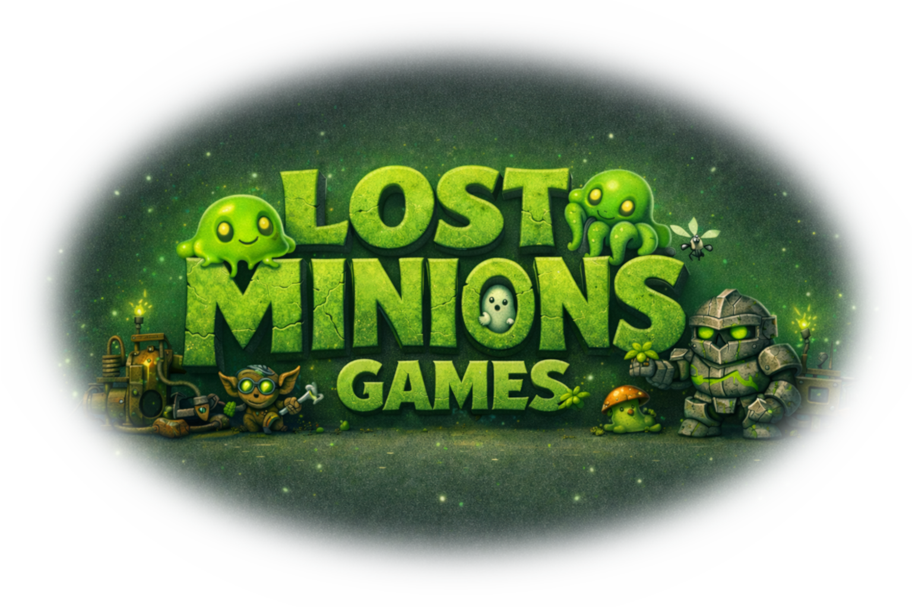

  

# 🎮 Lost Minions Games

> **Indie worlds, weird mechanics, and joyful bugs.**  
> *Where game ideas escape the lab.*

---

### 🧠 What We Do

Lost Minions Games is the home for our experiments in interactive worlds. 
From early prototypes to full projects, this org houses the code behind our:

- Single-player and co-op game ideas  
- Systems tests and gameplay sandboxes  
- Reusable game dev tooling and pipelines  

Every repo here is an experiment in curiosity, iteration, and controlled chaos.

---

### 🌐 Community Links

#### 💬 Discord
Hang out with other minions, playtest, and talk shop: 
🔗 https://lostminions.org/discord

#### 📱 Social Media

- 🌲 [linktr.ee](https://linktr.ee/lostminions)

| Platform | Link |
|---------|------|
| 🧵 **Etsy** | [etsy.com/shop/LostMinions](https://www.etsy.com/shop/LostMinions) |
| 📘 **Facebook** | [facebook.com/LostMinions](https://www.facebook.com/LostMinions) |
| 📸 **Instagram** | [instagram.com/lostminions](https://www.instagram.com/lostminions/) |
| 👾 **Reddit** | [reddit.com/r/LostMinions](https://www.reddit.com/r/LostMinions) |
| 🎥 **TikTok** | [tiktok.com/@lostminions](https://www.tiktok.com/@lostminions) |
| 🧪 **Twitch** | [twitch.tv/lostminions](https://www.twitch.tv/lostminions) |
| 🐦 **Twitter / X** | [twitter.com/LostMinions](https://twitter.com/LostMinions) |
| ▶️ **YouTube** | [youtube.com/@LostMinions](https://www.youtube.com/@LostMinions) |

---

### 💎 Support the Games

Help keep the prototypes running and new worlds in development: 
❤️ [Patreon.com/LostMinions](https://www.patreon.com/LostMinions)

---

### 💬 About This Organization

This GitHub organization hosts all official **Lost Minions Games** codebases — 
including core game projects, shared gameplay systems, and supporting dev tools.

You’ll find:

- 🕹️ Game prototypes and vertical slices  
- 🧱 Shared gameplay frameworks and components  
- 🧰 Build, testing, and automation tooling  
- 🎨 Game-adjacent utilities for art, data, and pipelines  
- 🧪 Odd experiments that went a little too far (on purpose)

Whether it’s Unreal, C#, or pure chaos, every repo here shares one mission: 
**build something weird, make it playable, and learn from it.**

---

### 🔗 Related Organizations

- 🧩 **Lost Minions (main org):** brand, bots, tools, and 3D designs  
  - https://github.com/LostMinions  
<!--
- 🎮 **Lost Minions Games:** indie prototypes, Unreal experiments, and shared gameplay systems
  - https://github.com/LostMinionsGames
-->
- 🌌 **The Portal Realm:** multiversal D&D campaigns, lore, and tooling  
  - https://github.com/ThePortalRealm  

---

> 👾 *“Lost but not forgotten — just respawning in another build.”*
